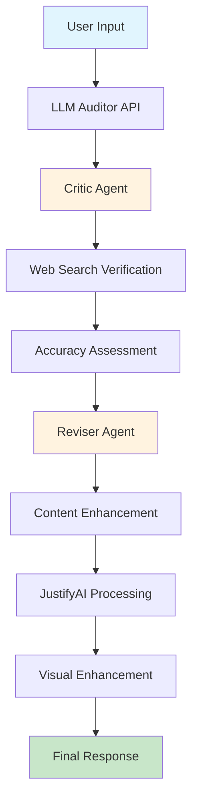

<div align="center">

# **JustifyAI** 
### *Intelligent Fact-Checking and Content Enhancement Platform*

[](https://nextjs.org/)
[](https://fastapi.tiangolo.com/)
[](https://cloud.google.com/)
[](https://www.typescriptlang.org/)

---

<div align="center">
  
</div>

---

**Transform AI responses into verified, trustworthy content with intelligent fact-checking and visual enhancement**

</div>

## Overview

JustifyAI is a comprehensive platform that combines LLM auditing with intelligent content enhancement. It systematically verifies AI-generated responses against real-world information and transforms them into visually appealing, trustworthy content.

### Problem Statement
- AI models generate inaccurate or misleading information
- Users lack systematic verification of AI-generated content
- Raw AI responses lack visual appeal and proper structure
- No reliable method to validate AI claims against factual data

### Solution
JustifyAI provides an automated fact-checking layer that:
- Analyzes AI responses for verifiable claims
- Verifies information using web search and knowledge bases
- Generates detailed audit reports with accuracy assessments
- Enhances content with visual formatting and images
- Rewrites responses to correct inaccuracies

## Key Features

### Intelligent Fact-Checking
- **Multi-Agent Architecture**: Specialized critic and reviser agents
- **Web Search Integration**: Real-time verification using Google Search
- **Claim Extraction**: Automatic identification of verifiable statements
- **Accuracy Scoring**: Detailed accuracy assessments and reporting

### Content Enhancement
- **Visual Formatting**: Structured, engaging content presentation
- **Image Generation**: Relevant visuals to accompany responses
- **Professional UI**: Clean, modern interface with smooth animations
- **Responsive Design**: Seamless experience across all devices

### Developer Integration
- **RESTful API**: Easy integration with existing applications
- **Cloud-Native**: Built on Google Cloud Platform for scalability
- **Real-time Processing**: Fast response times with streaming capabilities
- **Comprehensive Logging**: Detailed monitoring and debugging support

## Technology Stack

### Frontend
- **Next.js 15.2.4** - React framework with App Router
- **TypeScript** - Type-safe development
- **Tailwind CSS** - Utility-first styling
- **Framer Motion** - Smooth animations
- **Radix UI** - Accessible component library
- **Firebase** - Authentication and real-time features

### Backend
- **FastAPI** - High-performance Python web framework
- **Google Vertex AI** - Advanced AI and ML capabilities
- **Google Cloud Run** - Serverless container platform
- **Pydantic** - Data validation and serialization
- **Uvicorn** - ASGI server for production

### AI & ML
- **Google ADK** - Agent Development Kit
- **Google Gemini** - Large Language Model
- **Multi-Agent System** - Specialized fact-checking agents
- **Web Search Tools** - Real-time information verification

## Quick Start

### Prerequisites
- Node.js 18+ and npm/pnpm
- Python 3.10+
- Google Cloud Platform account
- Google Cloud CLI installed

### Installation

1. **Clone the Repository**
```bash
git clone https://github.com/your-username/genexhange1.git
cd genexhange1
```

2. **Backend Setup**
```bash
cd backend/llm-auditor
poetry install

# Set up environment variables
export GOOGLE_GENAI_USE_VERTEXAI=true
export GOOGLE_CLOUD_PROJECT=your-project-id
export GOOGLE_CLOUD_LOCATION=us-central1

# Authenticate with Google Cloud
gcloud auth application-default login
```

3. **Frontend Setup**
```bash
cd frontend
npm install
npm run dev
```

4. **Run the Application**
```bash
# Backend (Terminal 1)
cd backend/llm-auditor
poetry run python main.py

# Frontend (Terminal 2)
cd frontend
npm run dev
```

Visit `http://localhost:3000` to access the application.

## How It Works



### Process Flow

1. **Input Processing**: User submits query or statement for verification
2. **Claim Extraction**: Critic agent identifies verifiable claims
3. **Web Verification**: System searches for supporting evidence
4. **Accuracy Assessment**: Claims evaluated and scored for accuracy
5. **Content Revision**: Reviser agent corrects inaccuracies
6. **Visual Enhancement**: JustifyAI adds formatting and structure
7. **Final Output**: User receives verified, enhanced content

## Use Cases

### Educational Content
- Verify historical facts and scientific claims
- Enhance learning materials with visual aids
- Create trustworthy study resources

### News & Media
- Fact-check articles and reports
- Generate verified news summaries
- Create engaging visual content

### Business Applications
- Verify product information and claims
- Enhance marketing content with credibility
- Generate trustworthy customer communications

### Research & Development
- Validate research findings
- Enhance technical documentation
- Create reliable reference materials

## Example Output

### Before Processing
```
"Earth is further away from the Sun than Mars."
```

### After JustifyAI Processing
```
FACT-CHECKED RESPONSE

INACCURATE CLAIM DETECTED
Original: "Earth is further away from the Sun than Mars."

CORRECTED VERSION
"Mars is further away from the Sun than Earth."

VERIFICATION DETAILS
• Earth's average distance: ~150 million km
• Mars' average distance: ~228 million km
• Accuracy Score: 0% (Original) → 100% (Corrected)

SOURCES VERIFIED
• NASA Solar System Data
• Astronomical Almanac
• Multiple scientific databases
```

## API Documentation

### Query Endpoint
```http
POST /query
Content-Type: application/json

{
  "message": "Your text to verify",
  "user_id": "optional_user_id",
  "generate_image": true
}
```

### Response Format
```json
{
  "response": "Verified and enhanced content",
  "session_id": "unique_session_id",
  "justifyai_response": {
    "formatted_content": "Enhanced visual content",
    "images": ["generated_image_urls"],
    "accuracy_score": 95,
    "verification_details": {...}
  }
}
```

## Deployment

### Google Cloud Run
```bash
# Deploy backend
cd backend/llm-auditor
poetry install --with deployment
python3 deployment/deploy.py --create

# Deploy frontend
cd frontend
npm run build
# Deploy to your preferred platform
```

### Docker Support
```bash
# Build and run with Docker
docker build -t justifyai-backend ./backend/llm-auditor
docker run -p 8080:8080 justifyai-backend
```

## Contributing

We welcome contributions through:

1. **Bug Reports**: Report issues and bugs
2. **Feature Requests**: Suggest new features and improvements
3. **Code Contributions**: Submit pull requests for enhancements
4. **Documentation**: Help improve documentation and examples

### Development Setup
```bash
# Fork the repository
git clone https://github.com/your-username/genexhange1.git
cd genexhange1

# Install development dependencies
cd backend/llm-auditor
poetry install --with dev

cd frontend
npm install

# Run tests
cd backend/llm-auditor
python3 -m pytest tests
```

## License

This project is licensed under the **Apache License 2.0** - see the [LICENSE](LICENSE) file for details.

## Acknowledgments

- **Google Cloud Platform** for infrastructure support
- **Google ADK** for the agent development framework
- **Next.js Team** for the React framework
- **FastAPI** for the Python web framework
- **All Contributors** who help improve JustifyAI

---

<div align="center">

### **Star this repository if you find it helpful**

[](https://github.com/your-username/genexhange1)
[](https://github.com/your-username/genexhange1)

**Made with dedication by the JustifyAI Team**

[Website](https://your-website.com) • [Contact](mailto:contact@justifyai.com) • [Twitter](https://twitter.com/justifyai)

</div>